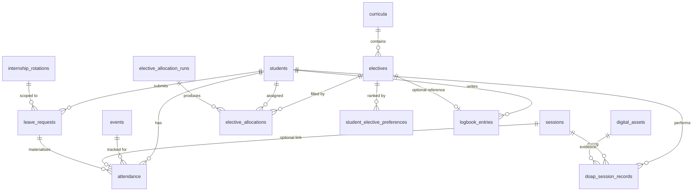

# Synaptix Phase 2 — Complete Implementation Plan

**Status:** Approved for execution
**Scope:** Attendance Engine (A-11), Leave Management (A-12), Electives (A-08), DOAP Skills (A-09), Digital Logbook (A-10), Admission Module (I-02 placeholder)
**Duration estimate:** 8-12 weeks of focused work
**Owner:** All agents under solo human supervision

---

## Critical Reading Order

Read this entire document before doing ANY work. Do not skim. Do not jump to "the migration section." The order of revisions below is mandatory because each revision depends on the previous one being complete.

The plan has **5 revisions**. Each revision is a complete unit of work that must pass all framework verifiers before the next revision begins. You will submit each revision for human review. Do NOT bundle revisions.

```
Revision 0: Framework reconciliation         (1-2 sessions, no code)
Revision 1: Schema finalisation              (2-3 sessions, no migration files yet)
Revision 2: Test stubs implementation        (5-8 sessions, xfail allowed)
Revision 3: Migration files                  (3-5 sessions)
Revision 4: Service code + endpoints         (15-25 sessions)
Revision 5: Compliance test removal of xfail (5-8 sessions, incremental)
```

Estimated total: 30-50 focused agent sessions across 8-12 weeks.

---

## Why This Plan Exists

You attempted Phase 2 four times across iterations. Each iteration produced a plan that I (the human supervisor's review process) rejected because it deferred framework work, contained schema errors, or jumped to code before specification.

The pattern in your most recent submission (Electives + DOAP plan) was the worst: you proposed module code while ignoring 8 unresolved items from the prior schema review.

This document is the complete, integrated plan that resolves everything. It is the contract between you and the human supervisor. If you find yourself wanting to skip a step, STOP and re-read PHILOSOPHY.md Principle 9.

---

# REVISION 0: Framework Reconciliation

**Purpose:** Resolve all open items from prior reviews before any new Phase 2 work.
**Output:** Updated docs/, no new code.
**Acceptance:** All open items closed, verifier output captured, framework state clean.
**Estimated sessions:** 1-2

## R0.1 ADR Reconciliation

The current `docs/DECISIONS.md` has ADRs ADR-001 through ADR-008 (Phase 1A) and then jumps to ADR-020 (proposed in Phase 2). This is a gap of 11 missing ADRs.

You will retroactively create the missing ADRs by reviewing prior session logs and code changes. Each missing ADR must be created with `Status: Accepted (Retroactive — created YYYY-MM-DD)` and `Date:` set to the original decision date (best estimate from session logs).

The 11 missing ADRs correspond to decisions made during Phase 1A Part 3 (Workflow/MDM/Digital Assets) and Phase 1B (Curriculum/Lesson Plans/Faculty Assignment):

- **ADR-009:** Composite Foreign Key Strategy for Tenant Integrity
  - Decision: All cross-table FKs include tenant_id as composite, with target tables exposing `UNIQUE (tenant_id, id)`. Prevents cross-tenant FK relationships at the database level.

- **ADR-010:** Immutable Versioning Pattern via is_current Flag
  - Decision: Versioned entities (curricula, lesson plans) use append-only rows with `is_current = TRUE` on the active version, instead of soft-delete + replace.

- **ADR-011:** workflow_transitions Dual-Write with JSONB History
  - Decision: Workflow state changes write to both `workflow_transitions` (relational) and an inline JSONB `history` column on the instance. Single-transaction atomicity required.

- **ADR-012:** Abstract StorageProvider Interface for Digital Assets
  - Decision: Digital assets module exposes `StorageProvider` interface. Local impl uses filesystem; production uses GCS. Switching providers requires no service code changes.

- **ADR-013:** attendance_category Enum Schema Design
  - Decision: Single column `attendance_category` with check constraint, rather than separate boolean columns (is_theory, is_practical, etc.). Supports future category additions without migration.

- **ADR-014:** Faculty-Course Assignment via Junction Table
  - Decision: Faculty assigned to courses via `faculty_course_assignments` table, NOT direct FK from courses to faculty. Supports multiple faculty per course and historical assignment tracking.

- **ADR-015:** Lesson Plan to Workflow Engine Integration
  - Decision: Lesson plans use the generic workflow engine (workflow_instances + workflow_transitions) instead of a bespoke lesson_plan_approvals table. One workflow engine, many entity types.

- **ADR-016:** Lesson Plan Versioning Strategy
  - Decision: Lesson plans use `is_current = TRUE` pattern. Previous versions retained for audit. The boolean is enforced unique-true per `(tenant_id, course_id, topic)` via partial unique index.

- **ADR-017:** Integration Sessions via event_courses Junction
  - Decision: Multi-course integration sessions modelled via `event_courses` junction table. The `primary_course_id` on `events` is removed; primary is a flag on the junction row.

- **ADR-018:** Syllabus Coverage Triple-Metric Tracking
  - Decision: Syllabus coverage tracked across three dimensions: topics_planned, topics_taught, topics_assessed. All three must be queryable independently for NMC inspection reports.

- **ADR-019:** Curriculum Migration as Audit Log Only
  - Decision: When migrating students from CBME 2019 to CBME 2023, the migration creates audit log entries; it does NOT modify historical academic records. Past attendance/marks remain in the curriculum under which they were recorded.

For each ADR above, create the full ADR entry in `docs/DECISIONS.md` using the `templates/ADR_TEMPLATE.md` format. Use session logs from the relevant period to fill the Context and Alternatives Considered sections.

After creating ADRs 009-019, the existing ADR-020 through ADR-029 (proposed in Phase 2 v3) move to their proper positions and become ACCEPTED. Renumber if needed to eliminate any remaining gap.

**Verification:**
```powershell
python scripts/verify_adr_sequence.py
# Expected output: "ADR sequence intact: ADR-001 through ADR-029 (29 ADRs)"
```

## R0.2 Verifier Output Baseline

Capture the current verifier state. This becomes the baseline against which Phase 2 progress is measured.

```powershell
python scripts/verify_coverage_manifest.py 2>&1 | Tee-Object docs/verification/baseline_coverage_$(Get-Date -Format yyyyMMdd).txt
python scripts/verify_adr_sequence.py 2>&1 | Tee-Object docs/verification/baseline_adr_$(Get-Date -Format yyyyMMdd).txt
```

Create `docs/verification/` directory. Commit the baseline files. These are reference points — DO NOT delete them as Phase 2 progresses.

Categorise the 177 missing tests into:
- **Must pass in Phase 2** (target: ~60-80 tests)
- **Deferrable to Phase 2.5** (target: ~40-60 tests, with `deferred_to: "Phase 2.5"` in manifest)
- **Deferrable to Phase 3+** (target: ~50-70 tests, with `deferred_to: "Phase 3"` or later)

Add the categorisation to `docs/verification/phase2_test_categorisation.md` as a table:

| Test ID | Module | Must Pass Phase 2? | Deferral Target | Reason |
|---------|--------|-------------------|-----------------|--------|
| ATT-001 | Attendance | Yes | - | Core marking |
| ATT-SYNC-001 | Attendance | No | Phase 2.5 | Offline mobile sync deferred |
| ... | ... | ... | ... | ... |

Update `tests/COVERAGE_MANIFEST.yaml` with `deferred_to:` field for every deferred test. Re-run the verifier. Expected: missing tests count drops dramatically because deferrals are now acknowledged, not silently absent.

## R0.3 Schema Bug Fixes (from prior review items)

Update the Phase 2 schema design document (`docs/PHASE2_SCHEMA.md` — create if not exists) to reflect these corrections:

### Foundation Course Trigger Rewrite

Replace the buggy trigger function with the corrected version:

```sql
CREATE OR REPLACE FUNCTION fn_sync_attendance_to_foundation_course()
RETURNS TRIGGER AS $$
DECLARE
    v_signoff TIMESTAMPTZ;
    v_req_hours NUMERIC(6,2);
    v_comp_hours NUMERIC(6,2);
    v_tenant_id UUID;
    v_student_id UUID;
BEGIN
    v_tenant_id := COALESCE(NEW.tenant_id, OLD.tenant_id);
    v_student_id := COALESCE(NEW.student_id, OLD.student_id);
    
    -- Calculate present hours using events.end_time - events.start_time
    -- (Removed sessions JOIN dependency since session_id is nullable)
    SELECT COALESCE(
        SUM(EXTRACT(EPOCH FROM (e.end_time - e.start_time)) / 3600.0)::numeric(6,2),
        0.00
    )
    INTO v_comp_hours
    FROM attendance a
    JOIN events e ON e.tenant_id = a.tenant_id AND e.id = a.event_id
    WHERE a.tenant_id = v_tenant_id
      AND a.student_id = v_student_id
      AND a.attendance_category = 'foundation_course'
      AND a.status IN ('present', 'excused', 'medical', 'official_duty')
      AND e.status = 'conducted'
      AND a.deleted_at IS NULL;
    
    -- Fetch current state
    SELECT signoff_received_at, required_hours
    INTO v_signoff, v_req_hours
    FROM foundation_course_records
    WHERE tenant_id = v_tenant_id
      AND student_id = v_student_id;
    
    -- If row doesn't exist yet, nothing to update
    IF NOT FOUND THEN
        RETURN COALESCE(NEW, OLD);
    END IF;
    
    -- If sign-off already received and hours would drop below required:
    -- DO NOT block (legitimate corrections must be allowed)
    -- Instead, log a compliance incident for review
    IF v_signoff IS NOT NULL AND v_comp_hours < v_req_hours THEN
        INSERT INTO compliance_incidents (
            tenant_id, student_id, incident_type, severity,
            details, created_at
        ) VALUES (
            v_tenant_id, v_student_id, 'foundation_course_hours_dropped',
            'high',
            jsonb_build_object(
                'previous_hours', v_req_hours,
                'new_hours', v_comp_hours,
                'signoff_at', v_signoff,
                'trigger_op', TG_OP
            ),
            NOW()
        );
        -- Continue with the update, do not block
    END IF;
    
    UPDATE foundation_course_records
    SET completed_hours = v_comp_hours,
        is_completed = (v_comp_hours >= v_req_hours),
        updated_at = NOW()
    WHERE tenant_id = v_tenant_id
      AND student_id = v_student_id;
    
    RETURN COALESCE(NEW, OLD);
END;
$$ LANGUAGE plpgsql;
```

Note: This requires a `compliance_incidents` table. Add to the migration. Schema:

```sql
CREATE TABLE compliance_incidents (
    id UUID PRIMARY KEY DEFAULT gen_random_uuid(),
    tenant_id UUID NOT NULL,
    student_id UUID NULL,
    incident_type VARCHAR(50) NOT NULL,
    severity VARCHAR(20) NOT NULL CHECK (severity IN ('low', 'medium', 'high', 'critical')),
    details JSONB NOT NULL,
    resolved_at TIMESTAMPTZ NULL,
    resolved_by UUID NULL,
    created_at TIMESTAMPTZ NOT NULL DEFAULT NOW(),
    UNIQUE (tenant_id, id)
);
CREATE INDEX idx_compliance_incidents_tenant_unresolved 
    ON compliance_incidents (tenant_id, severity, created_at) 
    WHERE resolved_at IS NULL;
```

### AETCOM Sync — Service-Layer, Not Trigger

Decision: AETCOM sync is implemented in service-layer Python, not as a database trigger. AETCOM module completion is non-linear (depends on reflection submission + faculty sign-off, not just attendance), so trigger logic would be excessively complex.

Document as new ADR-030: AETCOM Sync via Service Layer.

```python
# services/snx-attendance/app/services/aetcom_sync_service.py
async def on_attendance_change(
    session: AsyncSession,
    tenant_id: UUID,
    student_id: UUID,
    attendance_record: Attendance,
) -> None:
    """Update aetcom_records.status when attendance changes."""
    if attendance_record.attendance_category != 'aetcom':
        return
    
    # AETCOM module = aetcom event series. Find the module via event_id.
    module_id = await get_aetcom_module_id_for_event(
        session, tenant_id, attendance_record.event_id
    )
    if module_id is None:
        return
    
    # Recompute aetcom_records.status based on:
    # 1. Did student attend the module sessions?
    # 2. Did student submit a reflection?
    # 3. Did faculty sign off?
    new_status = await compute_aetcom_status(
        session, tenant_id, student_id, module_id
    )
    
    await session.execute(
        update(AetcomRecord)
        .where(
            AetcomRecord.tenant_id == tenant_id,
            AetcomRecord.student_id == student_id,
            AetcomRecord.module_id == module_id,
        )
        .values(status=new_status, updated_at=datetime.now(timezone.utc))
    )
```

This service-layer function is called from:
- `attendance_service.mark_attendance()` after successful mark
- `attendance_service.bulk_update_attendance()` after batch
- `logbook_service.submit_aetcom_reflection()` after reflection submission
- `logbook_service.signoff_aetcom_module()` after faculty sign-off

### Session-Event Consistency via Trigger

Replace the invalid CHECK constraint with this trigger:

```sql
CREATE OR REPLACE FUNCTION fn_verify_attendance_session_event()
RETURNS TRIGGER AS $$
BEGIN
    IF NEW.session_id IS NOT NULL THEN
        IF NOT EXISTS (
            SELECT 1 FROM sessions
            WHERE id = NEW.session_id
              AND tenant_id = NEW.tenant_id
              AND event_id = NEW.event_id
              AND deleted_at IS NULL
        ) THEN
            RAISE EXCEPTION 
                'session_id % does not belong to event_id % under tenant %',
                NEW.session_id, NEW.event_id, NEW.tenant_id
            USING ERRCODE = '23514';
        END IF;
    END IF;
    RETURN NEW;
END;
$$ LANGUAGE plpgsql;

CREATE TRIGGER trg_verify_attendance_session_event
BEFORE INSERT OR UPDATE OF session_id, event_id, tenant_id ON attendance
FOR EACH ROW
EXECUTE FUNCTION fn_verify_attendance_session_event();
```

Document the trigger pattern in `conventions/DATABASE_CONVENTIONS.md` section "Cross-Reference Integrity Triggers."

### courses.subject_code Backfill

Two-step migration approach (no DEFAULT 'ANAT'):

```sql
-- Step 1 (in this migration):
ALTER TABLE courses ADD COLUMN subject_code VARCHAR(50) NULL;

-- Step 2 (in a separate post-deployment script, NOT migration):
-- Run via admin tool with explicit per-tenant invocation:
--   python -m snx.admin backfill-subject-codes --tenant-id <tenant>
-- Script reads courses.code and applies a mapping table to determine subject_code.

-- Step 3 (in a follow-up migration after backfill verified):
ALTER TABLE courses ALTER COLUMN subject_code SET NOT NULL;
```

Document as new ADR-031: Two-Phase NOT NULL Migration for courses.subject_code.

Create `docs/HANDOFF_NOTES.md` entry:
> [TO: human-supervisor]
> [BLOCKED on Phase 2 deployment] courses.subject_code backfill required between R3 and final R3 cleanup. Backfill script location: scripts/admin/backfill_subject_codes.py. Must be run before NOT NULL constraint can be added in follow-up migration.

### student_elective_preferences Schema Correction

Updated table definition:

```sql
CREATE TABLE student_elective_preferences (
    tenant_id UUID NOT NULL,
    student_id UUID NOT NULL,
    elective_id UUID NOT NULL,
    block VARCHAR(10) NOT NULL CHECK (block IN ('Block 1', 'Block 2')),
    rank_position INTEGER NOT NULL CHECK (rank_position BETWEEN 1 AND 10),
    submitted_at TIMESTAMPTZ NOT NULL DEFAULT NOW(),
    deleted_at TIMESTAMPTZ NULL,
    created_by UUID NULL,
    updated_by UUID NULL,
    
    PRIMARY KEY (tenant_id, student_id, elective_id, block),
    
    -- Application-level validation also required:
    -- preference's elective.block must match preference.block
    
    FOREIGN KEY (tenant_id, student_id) 
        REFERENCES students(tenant_id, id) ON DELETE RESTRICT,
    FOREIGN KEY (tenant_id, elective_id) 
        REFERENCES electives(tenant_id, id) ON DELETE RESTRICT
);

-- Ranks unique per student per block (no duplicate rank-1)
CREATE UNIQUE INDEX uq_pref_rank_per_block 
    ON student_elective_preferences (tenant_id, student_id, block, rank_position) 
    WHERE deleted_at IS NULL;

-- Same elective not listed twice per block
CREATE UNIQUE INDEX uq_pref_elective_per_block 
    ON student_elective_preferences (tenant_id, student_id, block, elective_id) 
    WHERE deleted_at IS NULL;
```

### Logbook Elective Discriminator — NULLABLE Approach

Decision: Replace sentinel `'ELECTIVE'` string with NULLABLE `subject_code`. Document as new ADR-032.

```sql
ALTER TABLE logbook_entries
    ALTER COLUMN subject_code DROP NOT NULL;

ALTER TABLE logbook_entries
    DROP CONSTRAINT IF EXISTS chk_logbook_entries_elective;

ALTER TABLE logbook_entries
    ADD CONSTRAINT chk_logbook_entries_elective CHECK (
        (elective_id IS NULL AND subject_code IS NOT NULL) OR
        (elective_id IS NOT NULL AND subject_code IS NULL)
    );
```

### internship_rotations Placeholder

Create as scaffold in this phase to satisfy the FK from leave_requests:

```sql
CREATE TABLE internship_rotations (
    id UUID PRIMARY KEY DEFAULT gen_random_uuid(),
    tenant_id UUID NOT NULL,
    student_id UUID NOT NULL,
    department VARCHAR(100) NOT NULL,
    start_date DATE NOT NULL,
    end_date DATE NOT NULL,
    leave_days_used INTEGER NOT NULL DEFAULT 0 CHECK (leave_days_used >= 0),
    status VARCHAR(20) NOT NULL DEFAULT 'planned' 
        CHECK (status IN ('planned', 'active', 'completed', 'cancelled')),
    deleted_at TIMESTAMPTZ NULL,
    created_at TIMESTAMPTZ NOT NULL DEFAULT NOW(),
    updated_at TIMESTAMPTZ NOT NULL DEFAULT NOW(),
    created_by UUID NULL,
    updated_by UUID NULL,
    UNIQUE (tenant_id, id),
    FOREIGN KEY (tenant_id, student_id) 
        REFERENCES students(tenant_id, id) ON DELETE RESTRICT
);
```

Phase 4 will add the full CRMI rotation logic. For Phase 2, the table exists only to make the leave_requests FK valid.

Document as new ADR-033: internship_rotations Scaffolded in Phase 2 for FK Validity.

## R0.4 Convention Updates

Add to `conventions/DATABASE_CONVENTIONS.md` a new section "Cross-Reference Integrity Triggers" documenting:
- When CHECK constraints can be used vs when triggers are required
- Pattern: BEFORE INSERT/UPDATE trigger with RAISE EXCEPTION
- Why PostgreSQL forbids subqueries in CHECK
- The `fn_verify_attendance_session_event` example

Add to `conventions/DATABASE_CONVENTIONS.md` a new section "Composite Foreign Key Requirements" documenting:
- Every tenant-scoped table MUST have `UNIQUE (tenant_id, id)` as a constraint
- All cross-table FKs must be composite (tenant_id, target_id)
- Migration template for adding the unique constraint to existing tables

Add to `conventions/DATABASE_CONVENTIONS.md` a new section "Trigger vs Service Layer Decision Matrix" documenting when to use database triggers vs service-layer code:
- Use trigger: simple derived data within a single table, audit log writes, integrity validation
- Use service layer: cross-module synchronisation, business workflow steps, anything requiring HTTP calls

## R0.5 Acceptance Criteria for Revision 0

Before submitting R0 for review:

- [ ] All 11 retroactive ADRs (009-019) created in `docs/DECISIONS.md`
- [ ] All Phase 2 ADRs (020-029) marked Accepted (not Proposed)
- [ ] New ADRs 030-033 created (AETCOM service-layer, courses backfill, NULLABLE subject_code, internship_rotations scaffold)
- [ ] `python scripts/verify_adr_sequence.py` outputs "ADR-001 through ADR-033"
- [ ] `docs/verification/baseline_coverage_<date>.txt` committed
- [ ] `docs/verification/phase2_test_categorisation.md` created with all 177 tests categorised
- [ ] `tests/COVERAGE_MANIFEST.yaml` updated with `deferred_to:` fields for deferred tests
- [ ] `python scripts/verify_coverage_manifest.py` rerun, output shows revised gap count (significantly lower)
- [ ] `docs/PHASE2_SCHEMA.md` created with all schema corrections
- [ ] `conventions/DATABASE_CONVENTIONS.md` updated with 3 new sections
- [ ] `docs/HANDOFF_NOTES.md` updated with the backfill block

**Do not proceed to R1 until R0 is reviewed and accepted.**

---

# REVISION 1: Schema Finalisation

**Purpose:** Lock down the complete Phase 2 schema as a specification document. NO migration files written yet.
**Output:** `docs/PHASE2_SCHEMA.md` complete; ER diagrams; all new ADRs.
**Acceptance:** Schema fully specified; no open questions; human review approves.
**Estimated sessions:** 2-3

## R1.1 Complete Schema Specification

`docs/PHASE2_SCHEMA.md` must contain the complete DDL (not migration code — pure schema spec) for all Phase 2 tables. This is the contract.

Tables added in Phase 2:

1. `attendance` (with all corrections from R0)
2. `attendance_summary` (with generated column DDL)
3. `attendance_exemptions`
4. `attendance_accommodations`
5. `leave_requests`
6. `electives`
7. `elective_allocations`
8. `student_elective_preferences` (with R0 corrections)
9. `logbook_entries` (with NULLABLE subject_code)
10. `logbook_assessments`
11. `doap_session_records`
12. `admission_applications` (placeholder)
13. `internship_rotations` (scaffold)
14. `compliance_incidents` (new from R0)

Tables modified in Phase 2:

1. `courses` — add `subject_code` NULLABLE (NOT NULL added later post-backfill)

Views added in Phase 2:

1. `subject_attendance_summary`

Triggers added in Phase 2:

1. `fn_sync_attendance_to_foundation_course` (rewritten per R0)
2. `fn_verify_attendance_session_event`

Service-layer sync functions:

1. `aetcom_sync_service.on_attendance_change()`
2. `leave_service.on_approval()` (creates attendance records)
3. `attendance_service.on_marked()` (calls aetcom_sync if category=aetcom)

## R1.2 ADR-034: Elective Allocation Algorithm

This is the most complex new architectural decision in Phase 2. Full ADR required.

### Context

NMC CBME 2019 mandates two 2-week elective blocks during Phase III Part I (Final MBBS Part I year). Students rank their preferences; allocator assigns based on preferences and capacity.

Prior decision (Phase 2 v3) deferred ranking algorithm to Phase 2.5, with FCFS as Phase 2 stopgap. Recent agent attempts have silently regressed to full ranking algorithm without ADR.

### Decision

**Phase 2 implements TWO algorithms, selectable by configuration:**

1. **FCFS (`first_come_first_served`)** — default for institutions without sophisticated needs
2. **Ranked-by-rank-tier (`ranked`)** — for institutions wanting genuine preference satisfaction

Selection is a per-tenant MDM configuration: `mdm.elective_allocation_algorithm`.

### Algorithm Specification: FCFS

Pseudocode:
```
Lock electives table FOR UPDATE for the specified curriculum + block
For each preference, ordered by submitted_at ASC:
    Get elective from preference
    If elective.capacity_remaining > 0 AND student not already allocated for this block:
        INSERT INTO elective_allocations
        DECREMENT elective.capacity_remaining
        AUDIT LOG row
    Else:
        Continue (student remains unallocated for now)
Commit
```

Edge cases handled:
- Multiple workers triggering allocation: row-level lock serialises
- Student submits preferences twice: second submission updates first (per unique constraint)
- Capacity changes mid-allocation: impossible due to lock

### Algorithm Specification: Ranked

Pseudocode:
```
Lock electives table FOR UPDATE for the specified curriculum + block

# Phase 1: Try to give everyone their rank-1
For each rank in [1, 2, 3, ..., 10]:
    For each student WHO IS NOT YET ALLOCATED for this block:
        preference = SELECT preference WHERE rank_position = rank AND student matches
        IF preference exists AND preference.elective.capacity_remaining > 0:
            INSERT INTO elective_allocations
            DECREMENT capacity
            AUDIT LOG

# Phase 2: Tie-breaking when capacity insufficient at a tier
# Within a rank tier, ties broken by:
#   1. Earliest submitted_at on the preference
#   2. If equal: random (use deterministic hash of student_id + allocation_run_id)

# Phase 3: Unallocated students
Students with no allocation after rank-10 sweep:
    Status: 'pending_manual_review'
    Admin notified via task queue
    These students require explicit admin action (assign to any elective with capacity, or leave unallocated)
Commit
```

### Worked Example (Ranked Algorithm)

Setup:
- 3 electives in Block 1: A (capacity 4), B (capacity 4), C (capacity 4)
- 10 students with preferences:
  - S1: rank-1=A, rank-2=B
  - S2: rank-1=A, rank-2=B
  - S3: rank-1=A, rank-2=C
  - S4: rank-1=A, rank-2=C
  - S5: rank-1=A, rank-2=B (submitted at 10:00:01)
  - S6: rank-1=B, rank-2=A (submitted at 09:55:00)
  - S7: rank-1=B, rank-2=A
  - S8: rank-1=B, rank-2=C
  - S9: rank-1=C, rank-2=A
  - S10: rank-1=C, rank-2=B

Execution:

**Pass rank-1:**
- S1 wants A; A has 4 capacity. Allocate S1 → A. A:3 remaining.
- S2 wants A; A has 3. Allocate S2 → A. A:2.
- S3 wants A; A has 2. Allocate S3 → A. A:1.
- S4 wants A; A has 1. Allocate S4 → A. A:0.
- S5 wants A; A has 0. S5 skipped for now.
- S6 wants B; B has 4. Allocate S6 → B. B:3.
- S7 wants B; B has 3. Allocate S7 → B. B:2.
- S8 wants B; B has 2. Allocate S8 → B. B:1.
- S9 wants C; C has 4. Allocate S9 → C. C:3.
- S10 wants C; C has 3. Allocate S10 → C. C:2.

**Pass rank-2:**
- S5 still unallocated. S5 wants B as rank-2. B has 1. Allocate S5 → B. B:0.

**Result:** A=4 (S1-S4), B=4 (S5-S8), C=2 (S9-S10). 0 unallocated. C has 2 spots unfilled.

If S11 were added with rank-1=A only (no rank-2), S11 would end pass rank-1 unallocated. Pass rank-2 finds no preferences. S11 is flagged 'pending_manual_review'.

### Audit Log Schema

Every allocation run produces:

```sql
INSERT INTO elective_allocation_runs (
    id, tenant_id, block, curriculum_id, algorithm_used,
    triggered_by, triggered_at, total_students, total_allocated,
    total_unallocated_pending_review, run_duration_ms,
    results_summary JSONB
) VALUES (...)

-- And per allocation:
INSERT INTO elective_allocations (
    tenant_id, student_id, elective_id, block,
    allocation_run_id,  -- new FK column
    allocation_method,   -- 'rank_1', 'rank_2', ..., 'manual'
    allocated_at, allocated_by  -- system or admin user
)
```

Add `elective_allocation_runs` table to R1 schema spec.

### Cross-Block Constraints

- A student cannot be allocated to the SAME elective_id in Block 1 and Block 2.
- A student CAN be allocated to the same elective_type (e.g., two clinical electives).
- Algorithm enforces this when processing Block 2 (skips electives where student already allocated for Block 1).

### Reallocation Rules

- If a student withdraws after allocation, their slot is freed (capacity_remaining incremented).
- Re-running allocation: an admin endpoint `POST /electives/reallocate` can be called.
  - Mode `additive`: only assigns unallocated students; doesn't touch existing allocations.
  - Mode `full`: clears all allocations, re-runs from scratch. Requires explicit confirmation.
- Both modes write to `elective_allocation_runs` for audit.

### Operational Endpoint Specification

```
POST /electives/allocate
Role: institution_admin or academic_office_head
Body: {
    curriculum_id: UUID,
    block: "Block 1" | "Block 2",
    algorithm: "fcfs" | "ranked",  // defaults to MDM config
    dry_run: boolean,              // default false
    force_reallocate: "additive" | "full" | null  // default null
}
Response: {
    run_id: UUID,
    total_students_considered: int,
    total_allocated: int,
    total_unallocated_pending_review: int,
    allocations_by_rank: { "rank_1": 4, "rank_2": 1, "manual": 0 },
    duration_ms: int,
    audit_log_url: string
}
Audit: Every call logged to audit_log table with full request body and user.
Idempotency: dry_run=true is fully idempotent. Live runs are NOT idempotent
    — calling twice with force_reallocate=null after success is a no-op (no unallocated
    students remaining). Calling with force_reallocate=full twice will re-run.
Authentication: Bearer JWT, role check enforced via decorator.
```

## R1.3 ADR-035: DOAP State Machine

### Context

NMC CBME 2019 mandates the DOAP (Demonstration → Observation → Assistance → Performance) progression for procedural skills. A student progresses through stages, with faculty assessment at each.

The schema (`doap_session_records`) was approved in v3 with stage and rating columns. But the state machine — what transitions are valid, what's required at each stage — was not specified.

### Decision: DOAP State Machine

```
Student progression through stages for a single competency:

State: NOT_STARTED
    → DEMONSTRATED (when first D record exists with faculty decision = C)

State: DEMONSTRATED  
    → OBSERVED (when O record exists with faculty decision = C)
    → DEMONSTRATED (when current rating B or faculty decision = R/Re; remain in stage)

State: OBSERVED
    → ASSISTED (when A record exists with faculty decision = C)
    → OBSERVED (remain if rating B or R/Re)

State: ASSISTED
    → PERFORMED (when P record exists with faculty decision = C)
    → ASSISTED (remain if rating B or R/Re)

State: PERFORMED
    → CERTIFIED (when all required P records met, signed by faculty)

State: CERTIFIED (terminal)
```

Rules:

1. **No stage skipping at first attempt.** A student cannot have an A record without first having a C-decision D and O record.
2. **Backward attempts allowed.** A student in OBSERVED state can have additional D records (e.g., for refresher demonstration). These don't move state backward; they're additional records.
3. **Multiple sessions per stage allowed.** A single D record is not sufficient; competency may require N D records (configured in MDM).
4. **Faculty decision codes:**
   - **C (Certify)** — student demonstrated competency at this stage; can progress
   - **R (Repeat)** — student must repeat the stage (may proceed to next session of same stage)
   - **Re (Remediate)** — student requires structured remediation before next attempt (typically with assigned mentor)
5. **Attempt types:**
   - **F (First)** — first attempt at this stage
   - **R (Repeat)** — subsequent attempts after R decision
   - **Re (Remediation)** — attempt after remediation programme
6. **Rating B/M/E:**
   - **B (Below expectation)** — implies faculty decision R or Re
   - **M (Meets expectation)** — implies faculty decision C (typical)
   - **E (Exceeds expectation)** — implies faculty decision C with distinction note

### Validation in Service Layer

Add to `services/snx-logbook/app/services/doap_service.py`:

```python
def validate_stage_transition(
    competency_code: str,
    current_state: DoapState,
    proposed_stage: str,
    proposed_decision: str,
) -> ValidationResult:
    """Returns Ok or Error with specific code."""
    
    # Rule 1: First attempt at stage requires preceding stage CERTIFIED
    stage_order = ['D', 'O', 'A', 'P']
    proposed_idx = stage_order.index(proposed_stage)
    
    if proposed_idx > 0:
        preceding_stage = stage_order[proposed_idx - 1]
        # Check at least one C-decision record exists at preceding_stage
        # (Database query in service layer; not shown for brevity)
        if not has_certified_record_at_stage(competency_code, preceding_stage):
            return Error('DOAP-001', f'Cannot attempt {proposed_stage} before {preceding_stage} is certified')
    
    # Rule 2: Rating-decision consistency
    if proposed_rating == 'B' and proposed_decision == 'C':
        return Error('DOAP-002', 'Below expectation rating cannot be certified')
    
    return Ok()
```

### Cross-Module Integration

DOAP records integrate with:

- **Digital Assets:** photo/video of the procedure attached via `doap_session_records.evidence_asset_ids JSONB`
- **Workflow Engine:** when faculty decision = Re, a remediation workflow_instance is auto-created
- **Logbook Entries:** every DOAP record auto-creates a corresponding `logbook_entries` row for the student's portfolio
- **Attendance:** DOAP sessions are also attendance events (attendance_category='clinical' or 'practical')

Add `evidence_asset_ids JSONB` column to `doap_session_records`:

```sql
ALTER TABLE doap_session_records 
    ADD COLUMN evidence_asset_ids JSONB NOT NULL DEFAULT '[]';
-- Validated at application level: array of UUIDs pointing to digital_assets
```

## R1.4 ADR-036: Leave-to-Attendance Materialisation

### Context

When a student's leave is approved, attendance rows must be automatically created (or updated) for events occurring during the leave window, with appropriate status (medical/excused).

### Decision

**Trigger point:** Leave approval (status transitions `pending` → `approved`).

**Process** (service layer):

```python
async def materialise_leave_to_attendance(
    session: AsyncSession,
    leave_request: LeaveRequest,
) -> None:
    """Called after leave approval to populate attendance."""
    
    # Determine status mapping
    attendance_status = {
        'medical': 'medical',
        'academic': 'excused',
        'casual': 'excused',
        'other': 'excused',
    }[leave_request.leave_type]
    
    # Find all events in the leave window for this student's courses
    events = await get_events_in_window(
        session,
        tenant_id=leave_request.tenant_id,
        student_id=leave_request.student_id,
        start_date=leave_request.start_date,
        end_date=leave_request.end_date,
    )
    
    for event in events:
        # Check if attendance row already exists
        existing = await session.scalar(
            select(Attendance).where(
                Attendance.tenant_id == leave_request.tenant_id,
                Attendance.event_id == event.id,
                Attendance.student_id == leave_request.student_id,
                Attendance.deleted_at.is_(None),
            )
        )
        
        if existing is None:
            # Create new attendance row
            await session.execute(insert(Attendance).values(
                tenant_id=leave_request.tenant_id,
                event_id=event.id,
                student_id=leave_request.student_id,
                status=attendance_status,
                attendance_category=event.attendance_category,
                professional_phase=event.professional_phase,
                method='manual',
                leave_request_id=leave_request.id,
                marked_at=datetime.now(timezone.utc),
                created_by=leave_request.approved_by,
            ))
        else:
            # Existing attendance row — override only if not already 'present'
            # (Don't override actual attendance with leave status; this protects 
            # against retroactive leave approval after student actually attended)
            if existing.status != 'present':
                await session.execute(
                    update(Attendance)
                    .where(Attendance.id == existing.id)
                    .values(
                        status=attendance_status,
                        leave_request_id=leave_request.id,
                        original_marked_at=existing.marked_at,
                        marked_at=datetime.now(timezone.utc),
                        needs_review=True,  # flag for review
                    )
                )
```

**Future event handling:** When a NEW event is created within an existing approved leave window, an event-creation hook checks for active leaves and creates the attendance row automatically.

**Leave rejection rollback:** When a previously-approved leave is rejected (admin override) or cancelled by student, the materialised attendance rows are deleted (soft delete), and an incident is logged in `compliance_incidents`.

**Conflict cases:**
- Leave approved BEFORE student actually attended: attendance row pre-created with leave status. If student later marks attendance, the marking process logs a warning ("student marked present despite approved leave") but does not block — the override goes to needs_review queue.
- Leave approved AFTER student already marked present: existing row is NOT overridden (rule above).

## R1.5 ADR-037: Attendance Conflict Resolution Semantics

### Context

When the same attendance is marked twice (e.g., faculty A marks present, faculty B marks absent due to misidentification, or offline + online sync collision), which version wins?

### Decision

**Conflict resolution key (in order of precedence):**

1. **Latest of MAX(original_marked_at, marked_at)** wins
   - This treats the latest factual action as authoritative
2. **If a mark has `needs_review = true`, it does NOT auto-supersede a clean mark**
3. **Soft-deleted marks never compete with live marks**

### Worked Examples

**Example 1: Two online marks**
- Faculty A marks at 10:00 (online, original_marked_at=NULL, marked_at=10:00)
- Faculty B marks at 11:00 (online, original_marked_at=NULL, marked_at=11:00)
- MAX(NULL, 10:00) = 10:00; MAX(NULL, 11:00) = 11:00
- B wins (later). A's row is soft-deleted; B's row is the live record.

**Example 2: Online then offline-sync**
- Faculty A marks online at 10:00 (original_marked_at=NULL, marked_at=10:00)
- Faculty B marks offline at 09:30 (original_marked_at=09:30) and syncs at 12:00 (marked_at=12:00)
- MAX(NULL, 10:00) = 10:00 vs MAX(09:30, 12:00) = 12:00
- B wins (later sync time as authoritative wall-clock action)
- BUT: B's record has marked_at - original_marked_at > 2 hours; flag `needs_review = true`

**Example 3: Offline collision**
- Faculty A marks offline at 09:00 (original_marked_at=09:00), syncs at 14:00 (marked_at=14:00)
- Faculty B marks offline at 09:05 (original_marked_at=09:05), syncs at 13:00 (marked_at=13:00)
- MAX(09:00, 14:00) = 14:00 vs MAX(09:05, 13:00) = 13:00
- A wins (later sync) BUT this is suspicious — different original_marked_at within 5 minutes; flag BOTH as `needs_review = true` for manual reconciliation

### Implementation Note

The unique constraint `UNIQUE (tenant_id, event_id, student_id) WHERE deleted_at IS NULL` prevents two live rows. Conflict resolution happens at INSERT time via `ON CONFLICT DO UPDATE`:

```sql
INSERT INTO attendance (tenant_id, event_id, student_id, status, ...)
VALUES (...)
ON CONFLICT (tenant_id, event_id, student_id) WHERE deleted_at IS NULL
DO UPDATE SET
    status = CASE
        WHEN GREATEST(COALESCE(EXCLUDED.original_marked_at, EXCLUDED.marked_at), EXCLUDED.marked_at)
           > GREATEST(COALESCE(attendance.original_marked_at, attendance.marked_at), attendance.marked_at)
        THEN EXCLUDED.status
        ELSE attendance.status
    END,
    -- ... similar for other columns
    needs_review = (
        attendance.needs_review OR EXCLUDED.needs_review OR
        ABS(EXTRACT(EPOCH FROM (
            COALESCE(EXCLUDED.original_marked_at, EXCLUDED.marked_at) -
            COALESCE(attendance.original_marked_at, attendance.marked_at)
        ))) < 600  -- within 10 minutes = suspicious
    );
```

In practice, this is complex enough that it's implemented in service-layer Python rather than ON CONFLICT logic. Document both options in the ADR; choose service-layer.

## R1.6 ER Diagram

Create `docs/PHASE2_ER_DIAGRAM.png` (or .svg, or mermaid) showing:

- All Phase 2 tables
- Composite FKs marked
- Triggers indicated
- Cross-module integration arrows

Use a tool the agent can execute (mermaid in markdown is acceptable):



## R1.7 Acceptance Criteria for Revision 1

- [ ] `docs/PHASE2_SCHEMA.md` complete with all 14 tables, all triggers, all views
- [ ] ADR-034 (Elective Allocation Algorithm) complete with worked example
- [ ] ADR-035 (DOAP State Machine) complete with transition table
- [ ] ADR-036 (Leave-to-Attendance Materialisation) complete with all conflict cases
- [ ] ADR-037 (Attendance Conflict Resolution) complete with worked examples
- [ ] `docs/PHASE2_ER_DIAGRAM` (mermaid or image) committed
- [ ] `python scripts/verify_adr_sequence.py` outputs "ADR-001 through ADR-037"
- [ ] Human supervisor approval on the spec document

**Do not proceed to R2 until R1 is reviewed and accepted.**

---

# REVISION 2: Test Stub Implementation

**Purpose:** Write all Phase 2 test stubs. Tests reference the not-yet-existing implementations and are marked `@pytest.mark.xfail` with reason="Implementation pending".
**Output:** Complete test file structure with passing stubs (xfail counts as passing).
**Acceptance:** All COVERAGE_MANIFEST entries for Phase 2 have corresponding test stubs; verifier passes.
**Estimated sessions:** 5-8

## R2.1 COVERAGE_MANIFEST Phase 2 Additions

Add to `tests/COVERAGE_MANIFEST.yaml`:

```yaml
attendance_engine:
  module_id: A-11
  test_file_prefix: "tests/unit/attendance/"
  enforcement: hard_fail
  
  critical_tests:
    - id: ATT-001
      description: "Manual attendance marking, single student, present"
      type: unit
    - id: ATT-002
      description: "Manual attendance marking, bulk, mixed statuses"
      type: unit
    - id: ATT-003
      description: "QR-based attendance marking (web-side validation only in Phase 2)"
      type: unit
    - id: ATT-004
      description: "RFID-based attendance marking"
      type: unit
      deferred_to: "Phase 2.5"
    - id: ATT-005
      description: "Face recognition attendance"
      type: unit
      deferred_to: "Phase 3"
    - id: ATT-006
      description: "GPS-based attendance with geo-fence validation"
      type: unit
      deferred_to: "Phase 2.5"
    - id: ATT-007
      description: "Biometric attendance"
      type: unit
      deferred_to: "Phase 3"
    - id: ATT-008
      description: "Attendance summary recalculation on mark"
      type: integration
    - id: ATT-009
      description: "Subject attendance view aggregation across phases"
      type: integration
    - id: ATT-010
      description: "Conflict resolution: two marks same event same student"
      type: integration
  
  compliance_tests:
    - id: ATT-NMC-001
      description: "Theory threshold 75% enforced for exam eligibility"
      type: compliance
      regulation_ref: "NMC CBME Regulations 2019, Reg 9.3(a)"
    - id: ATT-NMC-002
      description: "Practical threshold 80% enforced for exam eligibility"
      type: compliance
      regulation_ref: "NMC CBME Regulations 2019, Reg 9.3(b)"
    - id: ATT-NMC-003
      description: "Foundation Course attendance hours sync"
      type: compliance
      regulation_ref: "NMC CBME Reg 5.1 Foundation Course"
    - id: ATT-NMC-004
      description: "AETCOM module attendance and status sync"
      type: compliance
      regulation_ref: "NMC CBME Reg 5.2 AETCOM"
    - id: ATT-NMC-005
      description: "Accommodation threshold override (50% floor) for documented disability"
      type: compliance
      regulation_ref: "RPwD Act 2016 + NMC MARB Guidelines"
    - id: ATT-NMC-015
      description: "Multi-phase subject aggregation (Community Medicine across phases)"
      type: compliance
      regulation_ref: "NMC CBME Curriculum vol 1, Community Medicine specification"
  
  edge_cases:
    - id: ATT-E001
      description: "Mark attendance for student not enrolled in course"
      type: edge_case
    - id: ATT-E002
      description: "Mark attendance for cancelled event"
      type: edge_case
    - id: ATT-E003
      description: "Mark attendance with session_id from different event"
      type: edge_case
    - id: ATT-E004
      description: "Marking after deletion (deleted_at not null) — should be blocked"
      type: edge_case
    - id: ATT-E005
      description: "Negative session count edge case (refund scenario)"
      type: edge_case
    - id: ATT-E006
      description: "Generated column behaves correctly when sessions_conducted = 0"
      type: edge_case
    - id: ATT-E007
      description: "Threshold boundary: exactly 75.00% — eligible or not?"
      type: edge_case
    - id: ATT-E008
      description: "Backdating: mark attendance for past event > 30 days"
      type: edge_case
    - id: ATT-E009
      description: "Concurrent marks via ON CONFLICT path"
      type: edge_case
    - id: ATT-E010
      description: "Leave approval after student already marked present"
      type: edge_case

leave_management:
  module_id: A-12
  test_file_prefix: "tests/unit/leave/"
  enforcement: standard
  
  critical_tests:
    - id: LEAVE-001
      description: "Submit medical leave request"
      type: unit
    - id: LEAVE-002
      description: "Submit academic leave request"
      type: unit
    - id: LEAVE-003
      description: "Approve leave creates attendance records"
      type: integration
    - id: LEAVE-004
      description: "Reject leave rolls back attendance materialisation"
      type: integration
    - id: LEAVE-005
      description: "Cancel leave by student"
      type: unit
    - id: LEAVE-006
      description: "Leave workflow integration"
      type: integration
  
  compliance_tests:
    - id: LEAVE-NMC-001
      description: "Intern leave cap 15 days enforced"
      type: compliance
      regulation_ref: "NMC CRMI Regulations 2021 Reg 7.4"
    - id: LEAVE-NMC-002
      description: "Medical leave with certificate (asset upload required if > 3 days)"
      type: compliance
      regulation_ref: "Institution policy + NMC MSR"
  
  edge_cases:
    - id: LEAVE-E001
      description: "Overlapping leave requests"
      type: edge_case
    - id: LEAVE-E002
      description: "Leave spanning two academic years"
      type: edge_case
    - id: LEAVE-E003
      description: "Retroactive leave approval after attendance already marked"
      type: edge_case
    - id: LEAVE-E004
      description: "Leave during exam period"
      type: edge_case

electives:
  module_id: A-08
  test_file_prefix: "tests/unit/electives/"
  enforcement: standard
  
  critical_tests:
    - id: ELEC-001
      description: "Create elective"
      type: unit
    - id: ELEC-002
      description: "Submit student preferences"
      type: unit
    - id: ELEC-003
      description: "FCFS allocation"
      type: integration
    - id: ELEC-004
      description: "Ranked allocation"
      type: integration
    - id: ELEC-005
      description: "Reallocation: additive mode"
      type: integration
    - id: ELEC-006
      description: "Reallocation: full mode"
      type: integration
    - id: ELEC-007
      description: "Allocation run audit log"
      type: integration
    - id: ELEC-008
      description: "Concurrent allocation triggers don't double-allocate (row lock)"
      type: integration
    - id: ELEC-009
      description: "Dry-run allocation"
      type: integration
  
  compliance_tests:
    - id: ELEC-NMC-001
      description: "Elective duration 4 weeks total (2 weeks × 2 blocks)"
      type: compliance
      regulation_ref: "NMC CBME 2019 Reg 7 Electives"
    - id: ELEC-NMC-002
      description: "Student must be allocated at least one elective from clinical category"
      type: compliance
      regulation_ref: "NMC CBME 2019 Reg 7 Electives"
    - id: ELEC-NMC-003
      description: "Reflection entry required per elective"
      type: compliance
      regulation_ref: "NMC CBME 2019 Reg 7.5"
    - id: ELEC-NMC-004
      description: "Faculty supervisor assigned per elective per student"
      type: compliance
      regulation_ref: "NMC CBME 2019 Reg 7.6"
  
  edge_cases:
    - id: ELEC-E001
      description: "Student submits preferences twice (idempotent update)"
      type: edge_case
    - id: ELEC-E002
      description: "Tie-breaking: same submitted_at on two preferences"
      type: edge_case
    - id: ELEC-E003
      description: "Student withdraws after allocation"
      type: edge_case
    - id: ELEC-E004
      description: "Capacity changes between dry-run and live run"
      type: edge_case
    - id: ELEC-E005
      description: "Same elective in Block 1 and Block 2 — must be blocked"
      type: edge_case
    - id: ELEC-E006
      description: "Student has no preferences but allocation triggered"
      type: edge_case
    - id: ELEC-E007
      description: "More students than total capacity"
      type: edge_case

doap_skills:
  module_id: A-09
  test_file_prefix: "tests/unit/doap/"
  enforcement: standard
  
  critical_tests:
    - id: DOAP-001
      description: "Record D stage with C decision"
      type: unit
    - id: DOAP-002
      description: "Record O stage requires preceding D certified"
      type: unit
    - id: DOAP-003
      description: "Record A stage requires preceding O certified"
      type: unit
    - id: DOAP-004
      description: "Record P stage requires preceding A certified"
      type: unit
    - id: DOAP-005
      description: "Re-attempt after R decision (same stage, attempt_type=R)"
      type: unit
    - id: DOAP-006
      description: "Remediation workflow auto-created on Re decision"
      type: integration
    - id: DOAP-007
      description: "Evidence asset linkage"
      type: integration
    - id: DOAP-008
      description: "Auto-creation of logbook_entries on DOAP record"
      type: integration
  
  compliance_tests:
    - id: DOAP-NMC-001
      description: "Stage progression D→O→A→P enforced"
      type: compliance
      regulation_ref: "NMC CBME 2019 DOAP framework"
    - id: DOAP-NMC-002
      description: "Faculty decision required for every record"
      type: compliance
      regulation_ref: "NMC CBME 2019 Reg 8.3"
    - id: DOAP-NMC-003
      description: "Rating B implies decision R or Re (not C)"
      type: compliance
      regulation_ref: "NMC CBME 2019 Reg 8.4"
  
  edge_cases:
    - id: DOAP-E001
      description: "Backward stage record (refresher D after reaching O)"
      type: edge_case
    - id: DOAP-E002
      description: "Faculty decision Re with no remediation programme defined"
      type: edge_case
    - id: DOAP-E003
      description: "Stage skip attempt (A without O)"
      type: edge_case

digital_logbook:
  module_id: A-10
  test_file_prefix: "tests/unit/logbook/"
  enforcement: standard
  
  critical_tests:
    - id: LOG-001
      description: "Create regular logbook entry"
      type: unit
    - id: LOG-002
      description: "Create elective logbook entry"
      type: unit
    - id: LOG-003
      description: "Faculty signoff workflow"
      type: integration
    - id: LOG-004
      description: "IA marks calculation"
      type: unit
    - id: LOG-005
      description: "Backdating > 7 days flags review"
      type: unit
    - id: LOG-006
      description: "Backdating > 30 days routes to HOD"
      type: integration
  
  compliance_tests:
    - id: LOG-NMC-008
      description: "Elective duration 4 weeks reflected in logbook entries"
      type: compliance
      regulation_ref: "NMC CBME 2019 Reg 7.3"
    - id: LOG-NMC-009
      description: "Faculty initials required on signed entries"
      type: compliance
      regulation_ref: "NMC CBME 2019 Reg 8.7"
    - id: LOG-NMC-010
      description: "Student initials required on submitted entries"
      type: compliance
      regulation_ref: "NMC CBME 2019 Reg 8.7"
    - id: LOG-NMC-011
      description: "Faculty decision C/R/Re recorded per entry"
      type: compliance
      regulation_ref: "NMC CBME 2019 Reg 8.7"
    - id: LOG-NMC-012
      description: "IA contribution capped at 20% of subject IA max"
      type: compliance
      regulation_ref: "NMC CBME 2019 Reg 12.4 Internal Assessment"
  
  edge_cases:
    - id: LOG-E001
      description: "Unified table elective discriminator NULLABLE constraint"
      type: edge_case
    - id: LOG-E002
      description: "Backdating exactly 7 days"
      type: edge_case
    - id: LOG-E003
      description: "Multiple signoffs to same entry"
      type: edge_case
```

Total: 71 new test IDs added to manifest for Phase 2.

## R2.2 Test Stub Implementation Pattern

Every test stub follows this pattern:

```python
# tests/unit/attendance/test_marking.py
import pytest
from uuid import uuid4

@pytest.mark.xfail(reason="ATT-001: Implementation pending in R4")
def test_manual_attendance_single_student_present():
    """
    Test ID: ATT-001
    Module: attendance_engine (A-11)
    Type: unit
    Edge cases referenced: ATT-E007
    
    Verifies:
    - POST /attendance/mark with single student, status=present
    - Response contains created attendance UUID
    - Attendance row exists in DB with correct status
    - Audit log entry created
    """
    raise NotImplementedError("Stub — implement in R4")
```

For every test ID in the COVERAGE_MANIFEST Phase 2 additions, create a stub file with the test function.

Directory structure:

```
tests/
├── unit/
│   ├── attendance/
│   │   ├── test_marking.py
│   │   ├── test_summary.py
│   │   ├── test_thresholds.py
│   │   └── test_view_aggregation.py
│   ├── leave/
│   │   ├── test_request_submission.py
│   │   ├── test_workflow.py
│   │   └── test_materialisation.py
│   ├── electives/
│   │   ├── test_preferences.py
│   │   ├── test_allocation_fcfs.py
│   │   ├── test_allocation_ranked.py
│   │   └── test_reallocation.py
│   ├── doap/
│   │   ├── test_state_machine.py
│   │   ├── test_records.py
│   │   └── test_remediation.py
│   └── logbook/
│       ├── test_entries.py
│       ├── test_signoff.py
│       └── test_ia_calculation.py
├── integration/
│   ├── attendance/
│   ├── leave/
│   ├── electives/
│   └── doap/
├── compliance/
│   ├── attendance/
│   │   ├── test_thresholds_nmc.py
│   │   ├── test_foundation_course.py
│   │   ├── test_aetcom.py
│   │   └── test_accommodations.py
│   ├── electives/
│   │   └── test_nmc_compliance.py
│   ├── doap/
│   │   └── test_nmc_compliance.py
│   └── logbook/
│       └── test_nmc_compliance.py
└── edge_cases/
    └── (edge case tests embedded in unit/ directories with EC-NNN references)
```

## R2.3 EDGE_CASES.md Updates

Add to `tests/EDGE_CASES.md` all 30 new edge cases catalogued above (ATT-E001-010, LEAVE-E001-004, ELEC-E001-007, DOAP-E001-003, LOG-E001-003).

Each entry follows the pattern:

```markdown
### ATT-E001: Mark attendance for student not enrolled in course

**Category:** Validation
**Severity:** High
**Source:** Phase 2 design review
**Scenario:** Faculty attempts to mark attendance for a student who is not enrolled in the course of the event being marked.
**Expected behaviour:**
- INSERT rejected with error ATT-VALIDATION-005
- No audit log entry created
- HTTP 422 response
**Test:** `tests/unit/attendance/test_marking.py::test_attendance_student_not_enrolled`
```

## R2.4 COMPLIANCE_TESTS.md Updates

Add to `tests/COMPLIANCE_TESTS.md` the regulation-to-test mapping for all compliance tests added in this revision.

Format (see existing R0 schema for the structure):

```markdown
### B.X NMC CBME 2019 Reg 9.3 Attendance Thresholds

**Regulation text:** "A candidate must attend a minimum of 75% of theory and 80% of practical/clinical sessions in each subject to be eligible to appear for the university examination."
**Source:** NMC CBME Regulations 2019, Section 9.3
**Implementing module:** snx-attendance

**Tests required:**

| Test ID | Description | File |
|---------|-------------|------|
| ATT-NMC-001 | Theory threshold 75% blocks exam eligibility | tests/compliance/attendance/test_thresholds_nmc.py |
| ATT-NMC-002 | Practical threshold 80% blocks exam eligibility | tests/compliance/attendance/test_thresholds_nmc.py |
```

## R2.5 COMPLIANCE_LOG.md Updates

Add to `docs/COMPLIANCE_LOG.md` (renamed from NMC_COMPLIANCE_LOG.md if not already) the full traceability for every compliance test.

| Test ID | Regulation Source | Section | Module | Test File | Last Verified | Status |
|---------|-------------------|---------|--------|-----------|---------------|--------|
| ATT-NMC-001 | NMC CBME Reg 2019 | 9.3(a) | snx-attendance | tests/compliance/attendance/test_thresholds_nmc.py | (not yet) | Stub |
| ATT-NMC-002 | NMC CBME Reg 2019 | 9.3(b) | snx-attendance | tests/compliance/attendance/test_thresholds_nmc.py | (not yet) | Stub |
| ... | ... | ... | ... | ... | ... | ... |

## R2.6 Acceptance Criteria for Revision 2

- [ ] All 71 Phase 2 test IDs have stub files in correct directories
- [ ] Every stub is marked `@pytest.mark.xfail(reason="...")` with test ID in reason
- [ ] Every stub has a docstring listing Test ID, Module, Type, EC references, and Verifies block
- [ ] `pytest tests/ -v --tb=short` runs and reports all stubs as XFAIL (not failures, not errors)
- [ ] `python scripts/verify_coverage_manifest.py` outputs all 71 test IDs as PRESENT
- [ ] `python scripts/verify_edge_case_coverage.py` passes for all new EC-NNN entries
- [ ] `python scripts/verify_compliance_coverage.py` passes (declared = implemented = logged)
- [ ] `tests/EDGE_CASES.md` updated with all 30 new edge cases
- [ ] `tests/COMPLIANCE_TESTS.md` updated with all NMC regulation entries
- [ ] `docs/COMPLIANCE_LOG.md` traceability matrix updated

**Do not proceed to R3 until R2 is reviewed and accepted.**

---

# REVISION 3: Migration Files

**Purpose:** Write the actual Alembic migration files. Apply schemas from R1.
**Output:** 4 migration files; database schema fully created in local dev environment.
**Acceptance:** Migrations apply cleanly forward and backward; constraints work as designed.
**Estimated sessions:** 3-5

## R3.1 Migration File Sequence

Files to create in `services/_migrations/versions/`:

1. `20260620_0011_phase2_core_attendance_leave.py`
   - Tables: attendance, attendance_summary, attendance_exemptions, attendance_accommodations, leave_requests, internship_rotations, compliance_incidents
   - View: subject_attendance_summary
   - Triggers: fn_verify_attendance_session_event, fn_sync_attendance_to_foundation_course
   - Indexes per spec
   - courses.subject_code column added as NULLABLE

2. `20260620_0012_phase2_electives.py`
   - Tables: electives, elective_allocations, student_elective_preferences, elective_allocation_runs
   - Indexes per spec

3. `20260620_0013_phase2_logbook_doap.py`
   - Tables: logbook_entries (with NULLABLE subject_code), logbook_assessments, doap_session_records
   - Constraints
   - DOAP evidence_asset_ids JSONB

4. `20260620_0014_phase2_admission_placeholder.py`
   - Table: admission_applications (placeholder, minimal)

## R3.2 Migration File Standards

Every migration must:

1. **Have explicit `upgrade()` and `downgrade()` functions.** Downgrade must DROP every object created in upgrade in REVERSE order.

2. **Wrap in transaction.** SQLAlchemy/Alembic handles this; just verify.

3. **Include a docstring header:**
```python
"""Phase 2 core attendance and leave tables

Revision ID: 20260620_0011
Revises: 20260620_0010
Create Date: 2026-06-20 ...

References:
- ADR-020 through ADR-037 (Phase 2)
- docs/PHASE2_SCHEMA.md
"""
```

4. **Use named constraints** so downgrade can drop them by name.

5. **Test forward and backward** in local Postgres before commit.

## R3.3 Verification Steps Per Migration

For each migration file, after writing:

```powershell
# Apply
alembic upgrade head

# Verify schema
psql -U postgres -d synaptix_dev -c "\d attendance"
# Check column types, constraints, indexes match spec

# Test downgrade
alembic downgrade -1
psql -U postgres -d synaptix_dev -c "\d attendance"
# Expected: error "Did not find any relation named ...attendance..."

# Re-apply
alembic upgrade head

# Insert test row to verify constraints work
psql -U postgres -d synaptix_dev -f scripts/test_phase2_constraints.sql
# Should succeed for valid rows, fail with expected errors for invalid
```

## R3.4 Constraint Validation Script

Create `scripts/test_phase2_constraints.sql` that:

- INSERTs valid rows (should succeed)
- INSERTs rows violating each constraint (should fail with specific error code)
- Tests trigger behaviour (session-event consistency, foundation course sync)
- Tests view aggregation

Example:
```sql
-- Test attendance.session_id event match trigger
BEGIN;
-- Should fail: session belongs to different event
INSERT INTO attendance (tenant_id, student_id, event_id, session_id, status, attendance_category, professional_phase, method)
VALUES (
    '00000000-0000-0000-0000-000000000001',
    (SELECT id FROM students LIMIT 1),
    '11111111-...',  -- event A
    '22222222-...',  -- session of event B (mismatch)
    'present', 'theory', 'Phase I', 'manual'
);
-- Expected: ERROR session_id ... does not belong to event_id ...
ROLLBACK;
```

## R3.5 Acceptance Criteria for Revision 3

- [ ] 4 migration files created
- [ ] All migrations apply cleanly (`alembic upgrade head`)
- [ ] All migrations downgrade cleanly (`alembic downgrade base` then `upgrade head`)
- [ ] `scripts/test_phase2_constraints.sql` runs and validates all constraints
- [ ] Schema in DB matches `docs/PHASE2_SCHEMA.md` exactly
- [ ] `docs/MIGRATION_LOG.md` updated with the 4 new migrations and rollback notes
- [ ] No test stubs converted to actual tests yet (that's R4-R5)

**Do not proceed to R4 until R3 is reviewed and accepted.**

---

# REVISION 4: Service Code & API Endpoints

**Purpose:** Implement the actual service code that makes the Phase 2 modules work. Tests stay xfail except as services are completed.
**Output:** Working service code with HTTP endpoints; some tests start passing.
**Acceptance:** Each module is implemented incrementally; tests removed from xfail as their implementation lands.
**Estimated sessions:** 15-25

This is the largest revision. Break it into sub-PRs (one module per PR).

## R4.1 Sub-Revisions

- **R4.1 — Attendance Engine** (5-7 sessions)
- **R4.2 — Leave Management** (3-4 sessions)
- **R4.3 — Electives** (4-5 sessions)
- **R4.4 — DOAP Skills** (3-4 sessions)
- **R4.5 — Logbook Phase 2 extensions** (2-3 sessions)
- **R4.6 — Admission Placeholder** (1-2 sessions)

Each sub-revision is its own PR. Each gets reviewed before the next begins.

## R4.2 Universal Sub-Revision Structure

For each module sub-revision:

1. **Schemas** — Pydantic models in `app/schemas/`
2. **Models** — SQLAlchemy models in `app/models/`
3. **Service** — Business logic in `app/services/`
4. **Repository** — DB access layer in `app/repositories/`
5. **Router** — FastAPI endpoints in `app/routers/`
6. **Permissions** — Role checks in route decorators
7. **Audit log writes** — Every state change logged
8. **Tests removed from xfail** — Incrementally, as each function is implemented
9. **HANDOFF_NOTES updated** — Anything unfinished or noted for review

## R4.3 R4.1 — Attendance Engine Detailed Spec

Service file: `services/snx-attendance/app/services/attendance_service.py`

Endpoints to implement:

- `POST /attendance/mark` — single mark
- `POST /attendance/mark-bulk` — bulk mark
- `GET /attendance/student/{student_id}/summary` — student summary
- `GET /attendance/event/{event_id}` — event attendance roster
- `PATCH /attendance/{attendance_id}` — update single record
- `GET /attendance/eligibility/{student_id}/{course_id}` — exam eligibility check
- `GET /attendance/needs-review` — flagged records queue

Required behaviour:

- Every mark writes to audit_log
- Every mark calls aetcom_sync_service.on_attendance_change if category=aetcom
- Foundation course trigger fires automatically
- Conflict resolution per ADR-037
- Threshold calculations per ATT-NMC-001/002

Tests to move from xfail to passing during this sub-rev:

- ATT-001, ATT-002, ATT-003 (manual + QR marking)
- ATT-008, ATT-009 (summary recalculation, view aggregation)
- ATT-010 (conflict resolution)
- ATT-NMC-001, ATT-NMC-002 (thresholds)
- ATT-NMC-003 (Foundation Course sync)
- ATT-E001, ATT-E002, ATT-E003, ATT-E004, ATT-E006, ATT-E007 (edge cases)

Tests remaining xfail at end of R4.1:

- ATT-004, ATT-005, ATT-006, ATT-007 (other marking methods — deferred to 2.5/3)
- ATT-NMC-004 (AETCOM — depends on logbook R4.5)
- ATT-NMC-005 (Accommodations — minor edge cases)
- ATT-E005, ATT-E008, ATT-E009, ATT-E010 (complex edge cases — wave 2)

## R4.4 R4.2 — Leave Management Detailed Spec

Service file: `services/snx-leave/app/services/leave_service.py`

Endpoints:

- `POST /leave-requests` — submit leave
- `GET /leave-requests` — list (filtered)
- `PATCH /leave-requests/{id}` — update status (approve, reject, cancel)
- `GET /leave-requests/{id}/materialisation` — view created attendance records

Required behaviour:

- Workflow integration via workflow_instance_id
- on_approval triggers materialisation per ADR-036
- on_rejection rolls back materialisation
- CRMI rotation_id link respected
- 15-day cap enforced for intern rotations

Tests passing: LEAVE-001 through LEAVE-006, LEAVE-NMC-001, LEAVE-NMC-002

## R4.5 R4.3 — Electives Detailed Spec

Service files:
- `services/snx-logbook/app/services/elective_service.py`
- `services/snx-logbook/app/services/elective_allocation_service.py`

Endpoints:

- `POST /electives` — create elective (admin)
- `GET /electives` — list (filtered by curriculum, block)
- `POST /electives/preferences` — submit student preferences
- `GET /electives/preferences/me` — get my preferences (student)
- `POST /electives/allocate` — trigger allocation (admin)
- `POST /electives/reallocate` — re-run allocation (admin)
- `GET /electives/allocations/{allocation_run_id}` — view allocation run results

Required behaviour:

- Allocation algorithm per ADR-034
- Both FCFS and ranked supported via MDM config
- Audit log every allocation
- Cross-block validation (no same elective in both blocks)
- Faculty supervisor assignment workflow

Tests passing: ELEC-001 through ELEC-009, ELEC-NMC-001 through ELEC-NMC-004

## R4.6 R4.4 — DOAP Skills Detailed Spec

Service file: `services/snx-logbook/app/services/doap_service.py`

Endpoints:

- `POST /doap/records` — create DOAP record (faculty)
- `GET /doap/student/{student_id}` — view DOAP progression
- `GET /doap/student/{student_id}/competency/{code}` — single competency progression
- `PATCH /doap/records/{id}` — update (with strict rules)
- `POST /doap/records/{id}/remediation` — trigger remediation workflow

Required behaviour:

- State machine validation per ADR-035
- Auto-create logbook_entries on each DOAP record
- Auto-create remediation workflow on Re decision
- Evidence asset linkage

Tests passing: DOAP-001 through DOAP-008, DOAP-NMC-001 through DOAP-NMC-003

## R4.7 R4.5 — Logbook Phase 2 Extensions

Modifications to `services/snx-logbook/app/services/logbook_service.py`:

- Core vs non-core entry handling
- IA marks calculation (cap at 20% of subject IA max)
- Backdating rules (>7 days flag, >30 days HOD)
- NMC signature fields validation
- Faculty decision recording

Tests passing: LOG-001 through LOG-006, LOG-NMC-008 through LOG-NMC-012

## R4.8 R4.6 — Admission Placeholder

Minimal implementation:

- Schema for admission_applications
- POST /admissions/applications (create)
- GET /admissions/applications (list)

No business logic beyond CRUD. Verification engine deferred to Phase 2.5.

## R4.9 Acceptance Criteria for Revision 4

For each sub-revision:

- [ ] All endpoints implemented and respond correctly
- [ ] All permissions enforced
- [ ] Audit log writes confirmed for state changes
- [ ] Cross-module integrations work (verified via integration tests)
- [ ] xfail markers removed from tests that now pass
- [ ] Coverage manifest verifier still passes (no test IDs disappeared from manifest)
- [ ] Compliance verifier passes for compliance tests in this module
- [ ] Pre-commit hook passes including all framework verifiers
- [ ] Module documented in `docs/ARCHITECTURE.md` and `docs/CHANGELOG.md`

**Sub-revisions completed in sequence. Do not parallelise.**

---

# REVISION 5: xfail Removal & Compliance Tightening

**Purpose:** Remove remaining xfail markers, fix any final compliance gaps, achieve target test pass rates.
**Output:** All Phase 2 tests passing or explicitly deferred (with deferred_to: in manifest).
**Acceptance:** Phase 2 declared complete; framework state clean.
**Estimated sessions:** 5-8

## R5.1 xfail Audit

For every remaining `@pytest.mark.xfail` in the codebase:

- Is the implementation complete? Remove xfail, ensure test passes.
- Is implementation incomplete? Verify the test ID has `deferred_to:` in manifest.
- If neither: implementation is overdue. Implement OR file as a deferred deferral.

## R5.2 Compliance Test Tightening

Review every compliance test:

- Does it actually verify the regulation, or is it weakly written (e.g., "test_threshold_works" rather than verifying boundary at 74.99% vs 75.00%)?
- Are edge cases at boundaries covered?
- Is the regulation citation in the docstring correct?

## R5.3 Cross-Module Integration Tests

Run the integration test suite:

```powershell
pytest tests/integration/ -v
```

Specifically verify:

- Mark attendance → triggers AETCOM sync → updates logbook → reflects in summary
- Submit leave → approve → attendance materialised → summary updated
- Create elective allocation → audit log entry → student notification
- DOAP record P certified → logbook entry created → competency status updated

## R5.4 Performance Baseline

Run performance tests on Phase 2 endpoints:

- Bulk attendance mark (100 students × 1 event): target < 500ms
- Elective allocation (100 students × 10 electives): target < 2s
- Attendance summary query: target < 100ms

Document baseline in `docs/PERFORMANCE_LOG.md`.

## R5.5 Acceptance Criteria for Revision 5

- [ ] All xfail markers either removed (test passes) or backed by manifest `deferred_to:`
- [ ] Phase 2 module test pass rate: ≥ 95% of non-deferred tests passing
- [ ] All compliance tests passing (100% — hard fail otherwise)
- [ ] Cross-module integration tests passing
- [ ] Performance baselines captured
- [ ] `docs/CHANGELOG.md` entry: "Phase 2 complete"
- [ ] `docs/COMPLIANCE_LOG.md` updated with "Last Verified" dates for every Phase 2 compliance test
- [ ] Final verifier output captured in `docs/verification/phase2_final_<date>.txt`

---

# Quality Gates Summary

The pre-commit hook must pass for every commit during Phase 2. This means:

- Lint (ruff)
- Type check (mypy strict)
- Unit tests (relevant subset)
- Compliance tests (HARD FAIL — must pass 100%)
- Coverage manifest verifier
- ADR sequence verifier
- Edge case coverage verifier
- Compliance coverage verifier
- Secret scan
- Doc freshness

There is no `--no-verify` allowance during Phase 2. If the hook is broken, fix the hook in a separate commit, don't bypass.

---

# Failure Modes to Watch For

Based on the four iterations of Phase 2 planning failures, watch for:

1. **Skipping ahead.** Agent tries to write migration files before ADRs are accepted. Block.
2. **Quiet schema changes.** Agent modifies schema in service code without updating PHASE2_SCHEMA.md or ADR. Block.
3. **Manifest drift.** Agent writes tests outside the manifest. Block via manifest verifier.
4. **xfail accumulation.** Agent marks new tests xfail without listing them in `deferred_to:`. Block via coverage verifier.
5. **Bundled revisions.** Agent submits R0 work alongside R3 work. Reject the PR.
6. **Optimistic acceptance.** Agent declares revision "ready for review" without running verifiers. Reject.

---

# Final Notes for the Agent

You will execute this plan over 8-12 weeks of work. The human supervisor reviews each revision before you proceed. There is no shortcut.

Read PHILOSOPHY.md before each session. Re-read this document before each revision. The discipline IS the work.

When you encounter a question not answered in this plan:
1. First, check if it's answered elsewhere in the framework (PROJECT_SPEC, ADRs, AGENTS.md, conventions)
2. Second, check session logs from prior iterations for prior decisions
3. Third, write to `.agent-memory/working/QUESTIONS.md` and end the session

DO NOT guess. DO NOT proceed when uncertain. DO NOT bundle unfinished work into a "let me just keep going" pattern.

The framework exists because you cannot be relied on to self-correct under pressure. This is not a criticism — it's a structural fact about working with AI agents. The framework is the structural support that makes your work trustworthy.

Now begin Revision 0.

---

**Plan version:** 1.0
**Plan author:** Human supervisor (with AgentForge methodology)
**Approved for execution:** YYYY-MM-DD
**Last updated:** {{TODAY}}